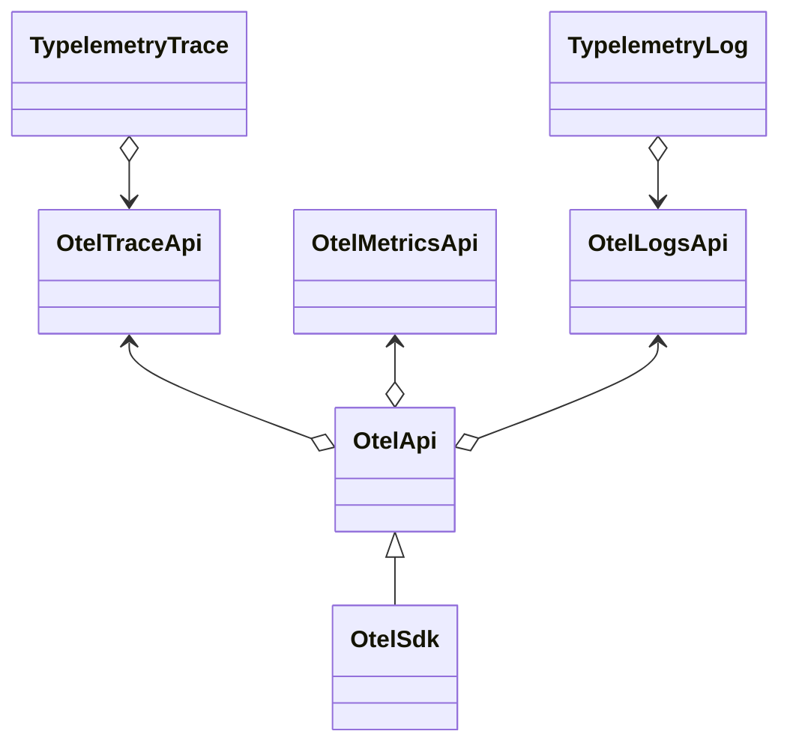

# Typelemetry

Typelemetry is a strongly typed wrapper of OpenTelemetry API for TypeScript.

## Architecture

```mermaid
classDiagram

TypelemetryLog o--> OtelLogsApi
TypelemetryTrace o--> OtelTraceApi
OtelTraceApi <--o OtelApi
OtelMetricsApi <--o OtelApi
OtelLogsApi <--o OtelApi
OtelApi <|-- OtelSdk
```

## [Trace](./examples/trace.ts)

## [Log](./examples/log.ts)
