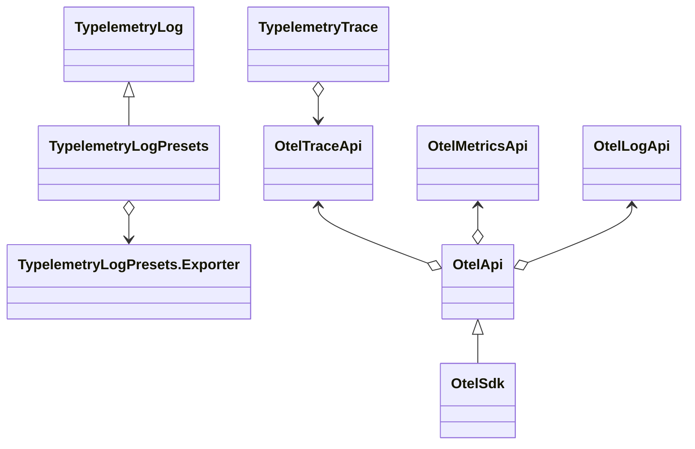

# Typelemetry

[](https://www.npmjs.com/package/@zimtsui/typelemetry)

Typelemetry is a strongly typed telemetry library for TypeScript.

## Architecture



Until now (2026-03), OpenTelemetry Log API has no stable release yet.

## Trace

```ts
import { Tracer } from '@zimtsui/typelemetry/trace';
import { NodeSDK } from '@opentelemetry/sdk-node';
import { ConsoleSpanExporter } from '@opentelemetry/sdk-trace-base';

const sdk = new NodeSDK({
    traceExporter: new ConsoleSpanExporter(),
});
sdk.start();
const tracer = Tracer.create('example', '0.0.1');

class A {
    @tracer.forkedAsync()
    public async f2(x: number): Promise<string> {
        return f3(x);
    }
    @tracer.forkedSync()
    public f4(x: number): string  {
        return String(x);
    }
}
const a = new A();

namespace F3 {
    export function create() {
        function f3(x: number): string {
            return a.f4(x);
        }
        return (x: number) => tracer.forkSync(f3.name, () => f3(x));
    }
}
const f3 = F3.create();

namespace F1 {
    export function create() {
        async function f1(x: number): Promise<string> {
            return await a.f2(x);
        }
        return (x: number) => tracer.forkAsync(f1.name, () => f1(x));
    }
}
const f1 = F1.create();

console.log(await f1(100));
await sdk.shutdown();
```

## Log

```ts
import { Channel, Exporter } from '@zimtsui/typelemetry/log';
import { stderr } from 'node:process';

// Declare all log levels whose values are sorted from verbose to severe.
enum Level { trace, debug, info, warn, error }

// Declare log levels for different environments.
const envlevels: Record<string, Level> = {
	debug: Level.trace,
	development: Level.debug,
	production: Level.warn,
};

// Determine the log level according to the environment variable.
declare const ENV: string;
const envLevel = envlevels[ENV] ?? Level.info;

// Create exporters.
const consoleExporter: Exporter = {
    monolith(message) {
        if (typeof message.payload === 'string') {
            console.log(message.level);
            console.log(message.payload);
        }
    },
    stream(chunk) {
        if (typeof chunk.payload === 'string') {
            stderr.write(chunk.payload);
        }
    },
};
Exporter.setGlobalExporter(consoleExporter);

// Create loggers.
const logger = {
	number: Channel.create<typeof Level, number>(Level, (message, level) => {
		if (level >= envLevel) Exporter.getGlobalExporter().monolith({
            scope: 'main',
            level: Level[level],
            payload: message,
            channel: 'number',
        });
	}),
	string: Channel.create<typeof Level, string>(Level, (message, level) => {
		if (level >= envLevel) Exporter.getGlobalExporter().monolith({
            scope: 'main',
            level: Level[level],
            payload: message,
            channel: 'string',
        });
	}),
};

// Use loggers.
logger.string.info('Hello');
logger.number.warn(10086);
```

### Level presets

```ts
import { Channel } from '@zimtsui/typelemetry/log';
import * as Presets from '@zimtsui/typelemetry/log/presets';
import { env, stderr } from 'node:process';
import { formatWithOptions } from 'node:util';

const envLevel = Presets.envlevels[env.NODE_ENV ?? ''] ?? Presets.Level.info;

export const channel = Channel.create(
	Presets.Level,
	(message, level) => {
		if (level >= envLevel) console.error(formatWithOptions({ depth: null, colors: !!stderr.isTTY }, message));
	},
);
```
